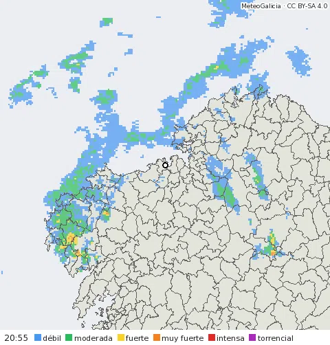
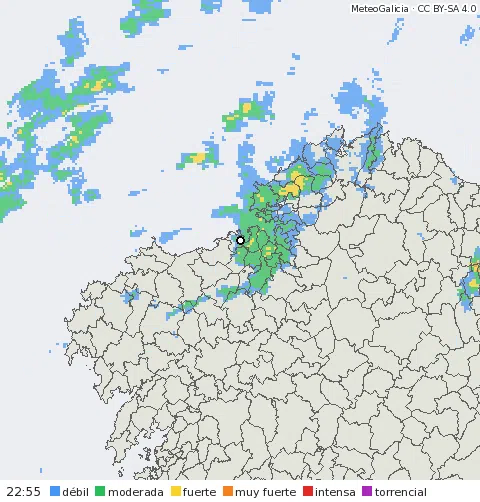

# MeteoGal

Integración personalizada de Home Assistant con los datos de [MeteoGalicia](https://www.meteogalicia.gal) para cualquier concello de Galicia: previsión, avisos, radar, estaciones y cámaras.

Funciona **sin clave**, con los servicios públicos de MeteoGalicia. Si quieres más detalle, como la lluvia y el viento por hora, puedes añadir una [clave de MeteoSIX](#clave-de-meteosix-opcional), gratuita y opcional.

> **Estado:** primera versión en preparación. Todavía no está publicada en HACS.



## Contenido

- [Qué ofrece](#qué-ofrece)
- [Instalación](#instalación), [configuración](#configuración) y [cómo quitarlo](#quitar-meteogal)
- Funciones: [el tiempo](#el-tiempo), [avisos](#avisos), [radar](#radar), [estación](#estación), [cámara](#cámara), [MeteoSIX](#clave-de-meteosix-opcional)
- [Todas las opciones](#todas-las-opciones) y [cada cuánto se actualiza](#cada-cuánto-se-actualiza)
- [Ejemplos](#ejemplos)
- [Limitaciones](#limitaciones), [problemas frecuentes](#problemas-frecuentes) e [informar de un problema](#informar-de-un-problema)

## Qué ofrece

Cada ubicación que configures es un dispositivo con el nombre oficial de su concello. Estas son sus entidades (en el ejemplo, una ubicación en A Coruña con Home Assistant en castellano):

| Entidad | Qué es | Necesita | Por defecto |
|---|---|---|---|
| `weather.a_coruna` | Tiempo actual y previsión diaria (8–9 días) y por horas | — | Activada |
| `sensor.a_coruna_nivel_de_aviso` | Nivel de los avisos vigentes ahora | — | Activada |
| `sensor.a_coruna_nivel_de_aviso_proximo` | Nivel de los avisos emitidos que aún no han empezado | — | Activada |
| `sensor.a_coruna_avisos_vigentes`, `…_avisos_proximos` | Número de avisos | — | Desactivadas |
| `image.a_coruna_radar` | Radar animado de las últimas horas | — | Activada |
| `image.a_coruna_radar_ultima_pasada` | Última pasada del radar, fija | — | Desactivada |
| `sensor.a_coruna_temperatura`, `…_lluvia_hoy`… | Lo medido en la estación elegida ([lista](#estación)) | Estación | Según el sensor |
| `image.a_coruna_camara` | Última foto de la cámara elegida | Cámara | Activada |
| `sensor.a_coruna_lluvia_esta_hora`, `…_proxima_lluvia` | Lluvia prevista | Clave de MeteoSIX | Activadas |
| `sensor.a_coruna_cota_de_nieve` | Cota de nieve prevista | Clave de MeteoSIX | Desactivada |

Los `entity_id` salen del nombre en el idioma de tu Home Assistant: en gallego serían, por ejemplo, `sensor.a_coruna_nivel_de_aviso_proximo` o `sensor.a_coruna_choiva_hoxe`.

Todo lo que viene de MeteoGalicia lleva la atribución «MeteoGalicia · Xunta de Galicia».

## Instalación

### Con HACS

1. En HACS, menú ⋮ → **Repositorios personalizados**.
2. Añade `https://github.com/iago-veiga/ha-meteogal` con el tipo **Integración**.
3. Busca **MeteoGal**, descárgalo y reinicia Home Assistant.

### A mano

1. Copia la carpeta `custom_components/meteogal` en `/config/custom_components/` de tu Home Assistant.
2. Reinicia Home Assistant.

Requiere Home Assistant 2026.3 o posterior.

## Configuración

Ajustes → Dispositivos y servicios → **Añadir integración** → **MeteoGal**.

1. **Ubicación:** elige un punto en el mapa. Por defecto es tu casa en Home Assistant.
2. **Confirmación:** MeteoGal deduce lo demás del punto; solo tienes que aceptar o corregir:

| Campo | Qué es | Por defecto |
|---|---|---|
| Concello | El de la previsión y los avisos | El del punto |
| Estación meteorológica | Opcional. De dónde salen los datos medidos. Cada estación mide cosas distintas: la lista indica si no mide viento o presión, o si no envía datos ahora | La más cercana |
| Usar la estación para el tiempo actual | Si la entidad del tiempo usa lo medido en la estación (ver [el tiempo](#el-tiempo)) | Sí |
| Cámara | Opcional. Una cámara de MeteoGalicia, con su distancia | La de la estación, si tiene; si no, ninguna |

En la lista de estaciones, junto a cada una, aparece lo que le falta de lo que usa el tiempo actual. Si la estación que se propone, la más cercana, no mide algo que otra cercana sí, se avisa encima. Por ejemplo, junto a la Torre de Hércules:

```text
La estación más cercana, Coruña-Torre de Hércules, no mide viento ni presión. Coruña-Dique (3,5 km) sí.

Estación meteorológica
  Coruña-Torre de Hércules (A Coruña) · 0,4 km · sin viento ni presión
  Coruña-Dique (A Coruña) · 3,5 km
  Punta Langosteira (Arteixo) · 11,0 km
  Guísamo (Bergondo) · 13,6 km · sin viento
  …
```

La más cercana sigue siendo la propuesta: suele parecerse más en temperatura y lluvia. Si quieres también el viento y la presión, elige otra; o quédate con ella: la entidad del tiempo tomará viento y presión de MeteoSIX, si tienes clave. Las marcas salen de la última lectura de cada estación: una que tenga ese día el anemómetro averiado saldrá «sin viento».

Para añadir más ubicaciones o cambiar una, entra en la integración y usa **Añadir ubicación** o **Cambiar ubicación** (con los mismos dos pasos; si no cambias de concello, se respeta lo que tenías elegido). Las opciones del radar están en **Configurar** y la clave de MeteoSIX en **Reconfigurar**: resumen en [todas las opciones](#todas-las-opciones).

## Quitar MeteoGal

- **Una ubicación:** Ajustes → Dispositivos y servicios → **MeteoGal** → en la ubicación, menú ⋮ → **Eliminar**. Se borran su dispositivo y sus entidades; las demás ubicaciones siguen igual.
- **Toda la integración:** en la misma pantalla, menú ⋮ de la entrada MeteoGal → **Eliminar**. Se borran todas las ubicaciones, sus entidades y la clave de MeteoSIX.
- **Los ficheros:** con HACS, busca MeteoGal, menú ⋮ → **Eliminar** y reinicia Home Assistant. Instalado a mano, borra la carpeta `/config/custom_components/meteogal` y reinicia.

Las automatizaciones y tarjetas que usaban entidades de MeteoGal no se borran solas: revísalas.

## El tiempo

`weather.<ubicación>`: estado actual, previsión diaria de 8 o 9 días y previsión por horas hasta el final del cuarto día. Se actualiza cada 30 minutos.

Cada dato del estado actual sale de la mejor fuente disponible, en este orden:

| Dato | Fuentes, en orden |
|---|---|
| Cielo | Observación del concello → previsión de la hora |
| Temperatura | **Estación** → observación del concello → previsión de la hora |
| Humedad, presión | **Estación** → MeteoSIX |
| Punto de rocío, rachas | **Estación** |
| Viento (velocidad y dirección, siempre de la misma fuente) | **Estación** → MeteoSIX → observación del concello (solo dirección) |
| Sensación térmica | Observación del concello |
| Nubosidad | MeteoSIX |

La estación solo se usa si has marcado **Usar la estación para el tiempo actual** y su lectura tiene menos de 1 hora. Si la estación no representa bien tu punto (está en la costa y tú no, o a otra altitud), desmárcalo: sus sensores seguirán, pero la entidad del tiempo usará lo demás.

La previsión diaria sale de MeteoGalicia (corto y medio plazo); la previsión por horas, de la previsión horaria de MeteoGalicia o, con clave, de MeteoSIX. Detalle en [docs/weather.md](docs/weather.md).

## Avisos

Avisos de MeteoGalicia para el concello: temperatura máxima y mínima, lluvia en 1 y 12 horas, niebla, nieve, tormenta, racha máxima de viento y, en los concellos de la costa, **viento en el mar y olas**. Hasta pasado mañana.

| Entidad | Estado | Atributos |
|---|---|---|
| Nivel de aviso | Sin avisos, amarillo, naranja o rojo, de los **vigentes ahora** | Del aviso principal (el más grave): tipo, nivel, inicio y fin |
| Nivel de aviso próximo | Lo mismo de los **emitidos que aún no han empezado** | Ídem |
| Avisos vigentes / próximos | Número (desactivadas) | — |

- El estado cambia **justo** cuando empieza o acaba cada aviso.
- Los atributos se ven en el menú **⋮ → Atributos** de la ventana de la entidad, traducidos («Tipo: Racha máxima de viento»).
- Para ver **todos** los avisos, usa la acción **`meteogal.get_warnings`** sobre el sensor de nivel (ver [ejemplos](#ejemplos)).

Detalle en [docs/avisos.md](docs/avisos.md).

## Radar



`image.<ubicación>_radar`: animación con el radar de MeteoGalicia de las últimas horas, centrada en tu ubicación, sobre el mapa de los concellos y con la intensidad por colores: **débil, moderada, fuerte, muy fuerte, intensa y torrencial**. Los contornos y tu ubicación (punto blanco) se ven aunque llueva en todas partes; el resto de tus ubicaciones salen como un círculo pequeño.

- Es lo que **está lloviendo** (con 10–15 minutos de retraso), no una previsión.
- Se actualiza con cada pasada nueva del radar, cada 10 minutos. El estado de la entidad es la hora de la última pasada.
- Para verla, añade una tarjeta **Imagen** con la entidad (ver [ejemplos](#ejemplos)): la anima sola.
- Opciones (en **Configurar**): periodo de **1, 2, 3 o 6 horas** (2 por defecto; con más horas, un fotograma cada 20 o 30 minutos para que no pese) y encuadre de **50 km o 100 km alrededor** o **toda Galicia** (100 km por defecto).
- `image.<ubicación>_radar_ultima_pasada` (desactivada por defecto): solo la última pasada, fija.

Detalle en [docs/radar.md](docs/radar.md).

## Estación

Si eliges una estación, sus medidas aparecen como sensores en el dispositivo de la ubicación. **Solo se crean los de lo que mide esa estación** (por ejemplo, muchas no miden viento ni presión). Se actualizan cada 10 minutos.

| Sensor | Qué es | Por defecto |
|---|---|---|
| Temperatura, Humedad, Presión | Medidos ahora (presión reducida al nivel del mar) | Activados |
| Lluvia últimos 10 min | Lluvia de la última lectura | Activado |
| Lluvia hoy | Acumulada desde las 00:00 | Activado |
| Viento, Racha | Velocidad media y racha de los últimos 10 minutos | Activados |
| Temperatura del agua | Solo en algunas estaciones de puerto | Activado |
| Dirección del viento, Punto de rocío | Medidos ahora | Desactivados |
| Máxima de hoy, Mínima de hoy, Viento máximo de hoy | Extremos del día hasta ahora | Desactivados |
| Horas de sol hoy, Evapotranspiración hoy | Acumulados del día (la evapotranspiración sirve para calcular el riego) | Desactivados |
| Radiación solar, Radiación ultravioleta | Medidas ahora (W/m²) | Desactivados |
| Temperatura a 10 cm del suelo, Temperatura del suelo, Humedad del suelo | Para heladas y huerta | Desactivados |
| Estación: última medida | Diagnóstico: hora de la última lectura, con el nombre de la estación y su distancia en los atributos | Activado |

- Solo se usan datos válidos según MeteoGalicia; con una lectura de más de 1 hora (la estación ha dejado de enviar), los sensores quedan en «Desconocido».
- Justo después de medianoche, MeteoGalicia publica el día nuevo sin valores todavía: los sensores «de hoy» quedan en «Desconocido» un rato, hasta que llegan los primeros datos del día.
- Una lectura con el viento exactamente a cero en todo (velocidad, racha y variación) se toma como dato ausente, no como calma: pasa a veces en estaciones que el resto del día miden bien.
- La estación también puede alimentar el [tiempo actual](#el-tiempo) (opción de la ubicación).
- **Si la estación deja de enviar datos durante más de un día**, Home Assistant lo avisa en **Ajustes → Reparaciones**: «La estación de A Coruña no envía datos». Al abrir el aviso puedes elegir otra estación, de la más cercana a la más lejana y con lo que le falta a cada una, o dejarla vacía para no usar ninguna. Si prefieres esperar, no hagas nada: el aviso desaparece solo cuando la estación vuelve a enviar.

Detalle en [docs/estaciones.md](docs/estaciones.md).

## Cámara

`image.<ubicación>_camara`: la última foto de la cámara de MeteoGalicia que elijas para la ubicación (hay 33, muchas en estaciones). Se renueva cada ~5 minutos; el estado es la hora de la foto y el atributo «Cámara», su nombre. Se ve con una tarjeta **Imagen**.

## Clave de MeteoSIX (opcional)

[MeteoSIX](https://www.meteogalicia.gal/web/modelos-numericos/meteosix) es el servicio de predicción numérica de MeteoGalicia. Da, hora a hora y en el punto exacto de tu ubicación, lo que la previsión pública no trae: cuánta lluvia va a caer, la velocidad del viento, la humedad y la presión. Es **gratuita**, pero pide una clave personal.

**Con clave**, además:

- **Previsión por horas completa:** lluvia (mm), velocidad y dirección del viento, humedad, nubosidad y presión, y un día más de alcance.
- **Tiempo actual:** humedad, presión, nubosidad y velocidad del viento (si no hay estación que lo mida).
- **Previsión diaria:** lluvia total (mm) y viento máximo de hoy y los tres días siguientes.
- **Lluvia esta hora:** mm previstos para la hora en curso.
- **Próxima lluvia:** la hora a la que empieza la primera hora con lluvia prevista (0,1 mm o más), empezando por la hora en curso, como el sensor equivalente de Météo-France en Home Assistant, pero por horas:

  | Situación | Qué muestra |
  |---|---|
  | Se prevé lluvia más tarde | La hora a la que empieza, por ejemplo «Dentro de 3 horas» |
  | Se prevé lluvia en la hora en curso | El inicio de esa hora, por ejemplo «Hace 56 minutos» a las 14:56: **está lloviendo o va a llover ya**. Como MeteoSIX va por horas, no sabe a qué minuto empezó |
  | No se prevé lluvia en unos 3 días | «Desconocido» |
  | MeteoSIX no responde o la clave no vale | «No disponible» |

- **Cota de nieve** de la hora en curso (desactivada; actívala si vives en la montaña).

Sin clave estos sensores no existen. Para otros cálculos, como la lluvia de las próximas 24 horas, usa la previsión por horas con `weather.get_forecasts`, que es lo que recomienda Home Assistant.

### Pedir la clave

1. Entra en la [página de MeteoSIX](https://www.meteogalicia.gal/web/modelos-numericos/meteosix) y solicita una clave para la API.
2. MeteoGalicia te la envía por correo electrónico. La clave va asociada a tu correo.

La clave es **personal**: no la compartas ni la publiques. Si la pierdes, pídela otra vez con el mismo correo y te llegará un recordatorio.

### Añadirla, cambiarla o quitarla

Ajustes → Dispositivos y servicios → **MeteoGal** → menú ⋮ de la entrada → **Reconfigurar**.

- **Añadir o cambiar:** pega la clave y guarda. MeteoGal la comprueba con MeteoSIX antes de guardarla.
- **Quitar:** deja el campo vacío y guarda. MeteoGal sigue con los datos públicos.

La clave se guarda una sola vez para todas tus ubicaciones. Añadirla o quitarla no cambia tus entidades ni tus automatizaciones: solo aparecen o desaparecen datos.

### Si la clave deja de valer

Home Assistant te avisa arriba del todo en **Ajustes**, como una reparación: «Autenticación caducada para MeteoGal». Al pulsarla se abre «La clave de MeteoSIX ya no vale», donde puedes escribir una clave nueva o dejar el campo vacío para seguir sin clave. Mientras tanto, MeteoGal sigue funcionando con los datos públicos. Si MeteoSIX no responde un rato, también se usan los datos públicos y se vuelve a intentar cada hora.

## Todas las opciones

| Dónde | Opción | Valores | Por defecto |
|---|---|---|---|
| Ubicación (al añadirla o **Cambiar ubicación**) | Punto, concello | Mapa, lista de concellos | Tu casa y su concello |
| Ubicación | Estación | Estaciones de la más cercana a la más lejana, o ninguna | La más cercana |
| Ubicación | Usar la estación para el tiempo actual | Sí / No | Sí |
| Ubicación | Cámara | Cámaras de la más cercana a la más lejana, o ninguna | La de la estación, si tiene |
| Entrada MeteoGal → **Configurar** | Periodo de la animación del radar | 1, 2, 3 o 6 horas | 2 horas |
| Entrada MeteoGal → **Configurar** | Encuadre del radar | 50 km, 100 km, toda Galicia | 100 km |
| Entrada MeteoGal → **Reconfigurar** | Clave de MeteoSIX | Clave o vacío | Sin clave |

Además, en cada entidad puedes activar las que vienen desactivadas (Ajustes → Entidades).

## Cada cuánto se actualiza

MeteoGal consulta a MeteoGalicia cada cierto tiempo; no hay nada que configurar.

| Fuente | Cada cuánto | Qué trae | Si falla |
|---|---|---|---|
| Previsión, observación y avisos del concello | 30 minutos | Previsión diaria y por horas, estado actual del concello, avisos | La entidad del tiempo queda «No disponible» hasta que responda. Si fallan solo los avisos, la observación o el medio plazo, se mantiene lo último bueno |
| Estación | 10 minutos (publica cada 10, con ~5 de retraso) | Lectura de 10 minutos y datos de hoy | Sus sensores quedan «No disponible»; el tiempo actual usa MeteoSIX o la observación del concello |
| MeteoSIX (con clave) | 1 hora (el modelo sale una o dos veces al día) | Previsión por horas de todas las ubicaciones, en una petición | Se sigue con los datos públicos |
| Radar | Mira cada 5 minutos; hay pasada nueva cada 10 | Solo descarga las pasadas nuevas | Las imágenes del radar quedan «No disponible»; el resto sigue |
| Cámaras | 5 minutos | Hora y dirección de la última foto | La imagen queda «No disponible» |

Los avisos cambian de estado justo al empezar o acabar, sin esperar a la siguiente consulta. Al arrancar Home Assistant, si MeteoGalicia no responde, Home Assistant reintenta la configuración él solo.

## Ejemplos

**Radar en el panel** (tarjeta Imagen):

```yaml
type: picture-entity
entity: image.a_coruna_radar
show_name: false
show_state: false
```

**Avisos en el panel** (tarjeta Markdown con el aviso principal próximo):

```yaml
type: markdown
content: >
  
  
  
  **Aviso {{ state_translated(e) | lower }}** por {{ tipos.get(state_attr(e, 'type'), 'otro fenómeno') }}:
  {{ as_timestamp(state_attr(e, 'start')) | timestamp_custom('%d/%m %H:%M') }} –
  {{ as_timestamp(state_attr(e, 'end')) | timestamp_custom('%H:%M') }}
  
  Sin avisos próximos.
  
```

**Todos los avisos en una automatización** (acción `meteogal.get_warnings`):

```yaml
actions:
  - action: meteogal.get_warnings
    target:
      entity_id: sensor.a_coruna_nivel_de_aviso
    response_variable: avisos
  - action: notify.mobile_app_mi_movil
    data:
      message: >
        
        {{ a.level }} {{ a.type }}: {{ a.start }} – {{ a.end }}{{ ' (vigente)' if a.active }}
        
```

Cada aviso trae `type` (`wind_gust`, `rain_12h`, `waves`…), `level` (`yellow`, `orange`, `red`), `start`, `end`, `warning_id` y `active`.

**Aviso naranja o rojo que empieza:**

```yaml
triggers:
  - trigger: state
    entity_id: sensor.a_coruna_nivel_de_aviso
    to: [orange, red]
```

**Riego: no regar si hoy ya llovió** (sensor de la estación):

```yaml
conditions:
  - condition: numeric_state
    entity_id: sensor.a_coruna_lluvia_hoy
    below: 2
```

**Llueve o va a llover en menos de una hora** (con clave de MeteoSIX):

```yaml
condition: template
value_template: >
  
  {{ lluvia is not none and lluvia <= now() + timedelta(hours=1) }}
```

## Limitaciones

- **Solo Galicia:** MeteoGalicia no da datos de otros lugares.
- **Viento sin velocidad (sin estación ni clave):** la previsión pública da la dirección y un tramo de intensidad (flojo, moderado…), no una cifra.
- **Sin probabilidad de lluvia por hora:** no la da ni la previsión pública ni MeteoSIX. Con clave, tienes la cantidad prevista (mm).
- **Con clave, la previsión diaria solo gana lluvia y viento:** MeteoSIX llega a 4 días y no trae probabilidad de lluvia ni índice UV.
- **La estación no está en tu casa:** mide donde está (a 6 km de mediana del centro de cada concello, hasta 18 km). Por eso su uso en el tiempo actual es opcional.
- **Radar:** muestra lo observado, no lo que va a llover; lejos del radar (el este de Ourense y Lugo) puede no ver la lluvia débil.

## Problemas frecuentes

| Qué ves | Por qué | Qué hacer |
|---|---|---|
| No aparecen los sensores de viento o de presión de la estación | Solo se crean los de lo que mide tu estación, y muchas no miden viento ni presión | Reconfigura la ubicación (**Cambiar ubicación**) y elige otra: la lista indica «sin viento» o «sin presión» |
| Los sensores de la estación están en «Desconocido» | La última lectura tiene más de 1 hora: la estación ha dejado de enviar | Espera. Si pasa de un día, aparecerá un aviso en **Reparaciones** para elegir otra |
| Los sensores «de hoy» están en «Desconocido» justo después de medianoche | MeteoGalicia publica el día nuevo antes de tener datos | Nada: se rellenan con la primera lectura del día |
| No tengo «Lluvia esta hora» ni «Próxima lluvia» | Necesitan la clave de MeteoSIX | [Añade la clave](#clave-de-meteosix-opcional) |
| «Autenticación caducada para MeteoGal» en Ajustes | MeteoSIX ya no acepta tu clave | [Cambia la clave o quítala](#si-la-clave-deja-de-valer) |
| El radar está «No disponible» | El servidor del radar de MeteoGalicia no responde | Nada: vuelve solo; el resto de MeteoGal funciona |
| En el radar no se ve la lluvia en el este de Ourense o Lugo | Está lejos del radar y la lluvia débil no llega a verse | Es una [limitación](#limitaciones) del radar |
| La entidad del tiempo está «No disponible» | MeteoGalicia no responde | Nada: se reintenta cada 30 minutos |

Para ver qué pasa por dentro, activa el registro de depuración: Ajustes → Dispositivos y servicios → **MeteoGal** → menú ⋮ → **Habilitar el registro de depuración**. Al desactivarlo, Home Assistant te descarga el registro.

## Informar de un problema

Abre una incidencia en [GitHub](https://github.com/iago-veiga/ha-meteogal/issues) y adjunta los **diagnósticos**: Ajustes → Dispositivos y servicios → **MeteoGal** → menú ⋮ → **Descargar diagnósticos**.

El fichero dice, para cada fuente (previsión y avisos, estación, MeteoSIX, radar y cámara), si su última actualización fue bien, cuándo y con qué datos está trabajando (por ejemplo, la última lectura de la estación o cuántas horas da MeteoSIX). **No incluye tu clave de MeteoSIX ni las coordenadas de tus ubicaciones**, que suelen ser tu casa: aparecen como `**REDACTED**`. Tampoco lleva imágenes.

## Versiones

Se numeran por año y mes de publicación, como Home Assistant: `2026.10.0` es la primera versión de octubre de 2026 y `2026.10.1`, una corrección de esa versión.

## Aviso

MeteoGal no es una integración oficial y no tiene relación con MeteoGalicia ni con la Xunta de Galicia. Los datos son de MeteoGalicia (Xunta de Galicia) y se publican con licencia [CC BY-SA 4.0](https://creativecommons.org/licenses/by-sa/4.0/) en el [portal de datos abiertos de la Xunta](https://abertos.xunta.gal). MeteoGal los muestra con la atribución «MeteoGalicia · Xunta de Galicia»; las imágenes del radar llevan «MeteoGalicia · CC BY-SA 4.0».

## Licencia

[Apache 2.0](LICENSE).

Incluye contornos municipales del [Instituto Geográfico Nacional](https://www.ign.es) (CC BY 4.0), los nombres oficiales de los concellos del [Nomenclátor de Galicia](https://abertos.xunta.gal/catalogo/territorio-vivienda-transporte/-/dataset/0270/nomenclator-galicia) (CC BY-SA 4.0) y la fuente DejaVu Sans. Detalle en [NOTICE](NOTICE).
